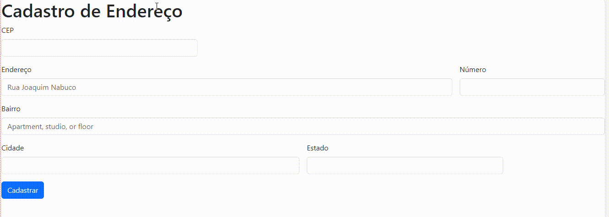
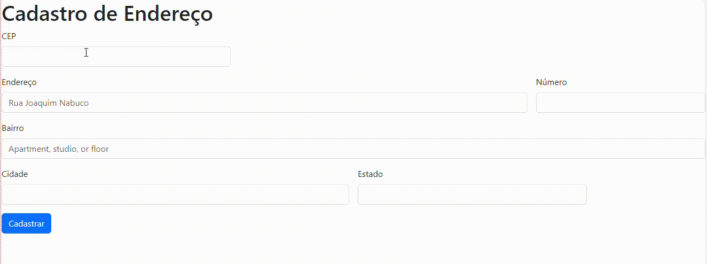
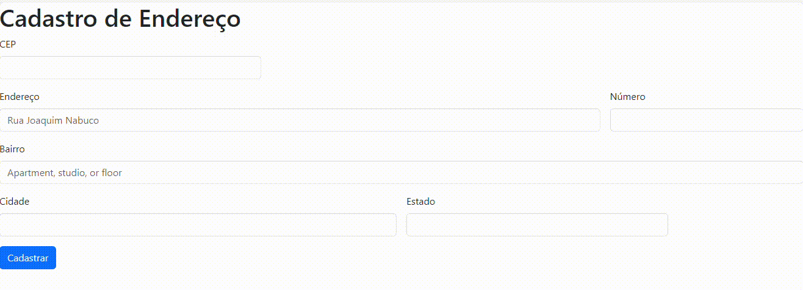
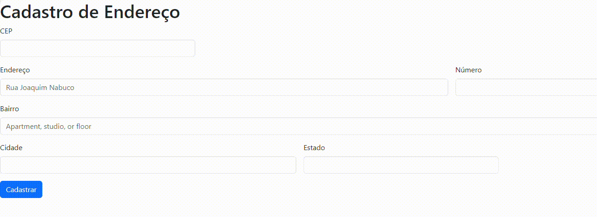
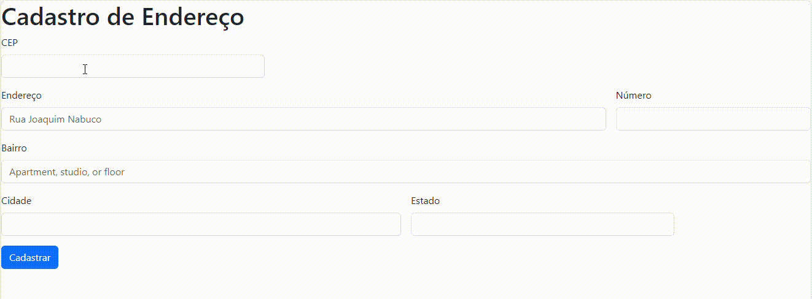

# Cadastro de Endereço

[Projeto](cadastro) 
[Descrição](#descri%C3%A7%C3%A3o)  
[introdução](#introdu%C3%A7%C3%A3o)  
[funcionalidade](#funcionalidade)  
[tecnologia utilizada](#tecnologia-utilizada)  
[fontes consultadas](#fontes-consultadas)  
[autores](#autores) 

## Descrição
Criamos uma pagina usando o codigo de Bootstrap que contia o HTML, depois copiamos o link para aicionar o CSS, depois fomos ajustando o CEP, endereço e o número para que o CEP fica-se na primeira linha. Apagamos o email e semha, pois não iriamos utilizar nomomento
A página HTML que apresenta um formulário para cadastrar um endereço, com campo para preencher o CEP, endereço, número, bairro, cidade e estado. Também utiliza Inicialização para aplicar estilos ao formulário. ❤️❤️

## Introdução
Esse codigo é uma aplicação para hum formulário em HTML para cadastro de endereço. Ele utiliza Inicialização para estilização e já possui campo pré-definidos para CEP, endereço, número, bairro, cidade e estado. Além disso, há hum trecho de codigo JavaScript  realizar a busca fazer endereço a a partir do CEP informado, consumindo a API fazer ViaCep. Através deste código, é possível preencher sistema operacional campo fazer formulário automaticamente após a inserção fazer CEP.

## Funcionalidade 
Esse codigo tem a função de adicionar um evento de cadastro ao adicionar o CEP, ou seja, quando o usuário Tiro o foco desse campo (ao clique para), a função pesquisarCep é realizado para verificar se o CEP é válido e preencher sistema operacional com informações Correspondentes ao CEP digitado. Essa é uma forma de automatizar a busca pelo endereço, facilitando o preenchimento desse formulário.

`FUNCIONALIDADE 1` - Quando o usuário colocar o CEP correto, os campos endereço, bairro, cidade e estado será preenchido adequadamente com as informações.

`FUNCIONALIDADE 2` - Quando o usuário digitar um CEP incorreto, aparecerá uma imagem na tela.

`FUNCIONALIDADE 3` - Quando não colocar nenhuma informação no CEP, aparecerá uma imagem.

`FUNCIONALIDADE 4` - Quando o usuario coloca uma informação muito curta e que não está de acordo com CEP.

`AWAIT` - faz a execução de uma função async pausar, para esperar pelo retorno da Promise , e resume a execução da função async quando o valor da Promise é resolvido 

`async` - significa que o valor de retorno da função será, "por baixo dos panos", uma Promise. 

`hasOwnProperty` - para determinar se um objeto possui a propriedade especificada como propriedade direta do objeto

## Tecnologias utilizadas
USAMOS  
HTML  
CSS  
BOOTSTRAP  

## Fontes consultadas
* [bootstrap] (https://getbootstrap.com/) - pagina usada para fazer os codigos

## Autores 
Heloá D'andrea Souza Nascimento

