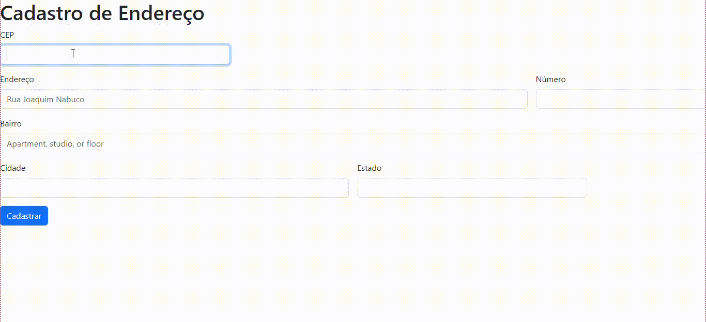

# form-CadEndereco
## Cadastro de Endereço

Criamos uma pagina usando o codigo de Bootstrap que contia o HTML, depois copiamos o link para aicionar o CSS, depois fomos ajustando o CEP, endereço e o número para que o CEP fica-se na primeira linha. Apagamos o email e semha, pois não iriamos utilizar nomomento
A página HTML que apresenta um formulário para cadastrar um endereço, com campo para preencher o CEP, endereço, número, bairro, cidade e estado. Também utiliza Inicialização para aplicar estilos ao formulário. ❤️❤️

USAMOS  
HTML  
CSS  
BOOTSTRAP  

* [bootstrap] (https://getbootstrap.com/) - pagina usada para fazer os codigos